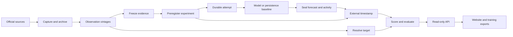

# Thesis core

Thesis should make a forecast reproducible as an experiment: preserve what the
forecaster knew, what it produced, which comparison was promised, and when those
commitments existed. The website should display that experiment, not participate
in collecting or resolving it.

The new core is one Python package with PostgreSQL for records and work queues,
content-addressed storage for source bytes and activity, and a read-only API for
the existing Next.js site. It lives alongside the current system while its
replacement path is tested. Historical records keep their original identities.

## Scientific records

Each record has an immutable canonical payload and a full SHA-256 identity.
Changes create a new record. PostgreSQL stores the canonical bytes, queryable
payload and typed relationships; artifact reads check their hashes.

| Record | What it freezes |
| --- | --- |
| Source series | Official endpoint, dimensions, units and adapter version |
| Target version | Measurement period, resolution rule, vintage policy and official release evidence |
| Forecaster version | Model request, prompts, harness, tool policy, settings and retry policy |
| Observation vintage | One value, its source bytes, capture time and publication evidence |
| Evidence bundle | Exact observations and artifacts available to a task |
| Evaluation task | Target, forecaster, evidence, cutoff, deadline and allowed attempts |
| Normalization | Concrete historical vintages, calculation version and frozen scale |
| Experiment | The complete task cohort, paired baseline and normalization records |
| Attempt and result | Durable sequence, execution evidence, failure or unknown outcome |
| Forecast run | Original 201-point CDF, actual prompt, output and returned model identity |
| Publication manifest and proof | Committed experiment/run, artifacts and verified timestamp receipt |
| Resolution and score | Exact observation, forecast, scoring version and eligibility reasons |

The dependency graph has one direction. Tasks reference their inputs;
experiments reference tasks. A task does not reference its experiment, avoiding
a content-hash cycle. Publication commits the concrete experiment and all of
its dependencies.

## Execution that survives failures

A worker claims a PostgreSQL job with a lease and fencing token. It commits the
attempt sequence and dispatch intent before invoking the model. A worker that
loses its lease cannot finalize a result.

A crash after dispatch produces an unknown outcome. It does not trigger another
model call automatically. Reconciliation uses only results committed while the
lease was valid, records a terminal event, and cannot choose between forecasts
after the outcome becomes known. The lowest valid durable attempt sequence is
the selected submission; an unresolved earlier attempt blocks selection.

Scientific writes and follow-up jobs share a transaction through an outbox.
Successful source capture survives another source's failure. A sealed forecast
survives a timestamp-service failure, and publication retries reuse its bytes.

## Time and evaluation

Operational timestamps are useful for recovery. External RFC 3161 receipts
establish that committed bytes existed by a verifiable time. Neither one proves
that an operator-controlled subprocess had no access to outside information;
the execution policy remains visible.

Publication timing is an interval. To show a forecast preceded an outcome, use
the earliest official publication boundary. To show evidence was available
before a cutoff, use the latest possible publication time or a completed
pre-cutoff capture. Date-only metadata therefore cannot admit information into
a morning replay merely because its date began at midnight. Timestamp ordering
also includes the accuracy declared in the signed receipt.

The initial prospective benchmark requires forecasts before the first official
print, including when resolution uses a later fixed vintage. Revision forecasts
would need a separately declared protocol. The initial experiment has one shared scheduling cutoff. Its cohort must be
independently witnessed before that cutoff and before execution; each attempt
commits the actual receipt hash. Consumers show the earlier effective bundle
freeze boundary separately, so the scheduling cutoff does not overstate the
evidence supplied.

Scores use the existing exact CDF CRPS calculation. Cross-series comparisons use
frozen normalized scores and require complete eligible paired coverage. Missing
normalization, failed runs and unknown attempts remain visible and prevent a
prospective rank. Raw CRPS remains available within its source units. Replay is
explicitly separate, and training exports require an as-of cutoff.

## First implementation

The first source families are ABS unemployment, Statistics Canada CPI and BEA
fixed investment. They share pure parsing code with the legacy resolver.
Publication timing that cannot be established stays unknown; parser success
alone does not establish prospective eligibility.

The local acceptance path uses real PostgreSQL, official fixtures, a persistence
baseline, a bounded real model transport check, actual timestamp verification,
resolution, scoring and the `/core` browser view. Tests cover concurrency,
crashes, tampering, ambiguous time, stale workers, scoring parity and legacy
invocation compatibility. The build ships in the existing Brier distribution
with a `core` extra and `thesis-core` CLI.

Production provisioning, migration of historical data and replacement of the
scheduled publishers are a subsequent release decision. The detailed build
contract and review history are in [the implementation plan](thesis-core-plan.md)
and [Fable review responses](thesis-core-plan-review-response.md).
